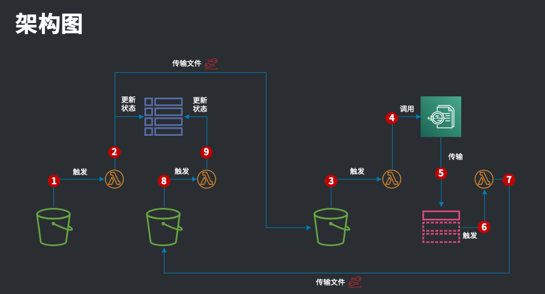
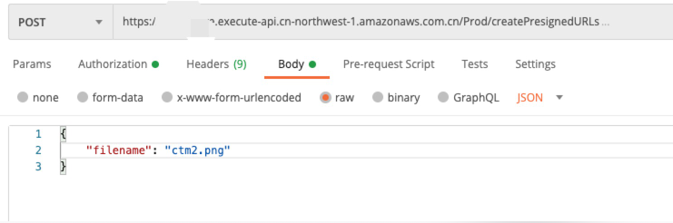
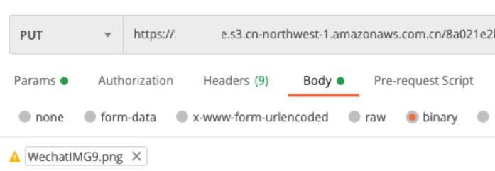

# Textract Boomerang

AWS 大陆区域（北京 / 宁夏）目前部分服务不完整，我们可以借助 AWS Global 区域的服务来打造我们需要的应用。AWS 大陆区域与 Global 区域完全隔离不互通，所以我们将创建受限的 IAM 账号，并使用 AK/SK 进行 API 互调。

本次演示以 OCR 为业务蓝本。流程为：将国内图片和 PDF 传输至 us-east-1 区域的 S3 桶，利用 Amazon Textract 进行文字和表单识别，并写回到国内 S3 桶。

## 免责声明

建议测试过程中使用此方案，生产环境使用请自行考虑评估。

当您对方案需要进一步的沟通和反馈后，可以联系 nwcd_labs@nwcdcloud.cn 获得更进一步的支持。

欢迎联系参与方案共建和提交方案需求, 也欢迎在 github 项目 issue 中留言反馈 bugs。

## 项目说明

本项目涉及的知识点有：

- 如何使用 S3 事件触发 Lambda
- 如何使用 NodeJS SDK 来访问 S3、SNS、DynamoDB、Textract、System Manager 等服务
- 如何使用 AK/SK 来调用不同用户、区域的 API
- 如何生成并使用 S3 预签名 URL（Presigned URL）来上传文件
- 如何使用 SAM 模板进行部署

架构图如下：

## 使用方式

### 准备工作

开始安装前，请确保系统已满足如下条件：

- 有 `npm` 或者 `yarn` 工具
- 有 AWS 命令行工具
- 有 Docker 工具
- 已配置好 AWS 的 Access Key ID 及 Access Secret Key （可运行 `aws configure` 命令来设置）
- 已有大陆区域和 Global 区域 AWS 账号各一个
- 已在大陆区域和 Global 区域各创建一个 IAM 用户
- 大陆区域 IAM 用户仅需要 S3 桶写入权限
- Global 区域 IAM 用户仅需要 S3 桶写入权限
- 在大陆区域创建两个桶，一个源用于放源文件、一个目标用于放识别后的 JSON
- 在 Global 区域创建两个桶，作用同上

### 构建项目

本项目分为中国大陆和 Global 两个部分，分别在 `tb-local` 和 `tb-global` 两个文件夹，需要分别构建。

在两个目录下分别运行 `sam build` 进行构建。构建时注意，`tb-local` 构建时需要使用北京或宁夏区域的 AK/SK，`tb-global` 则需要使用 Global 的 AK/SK。

建议用户开两个命令行窗口，并且使用 `aws configure --profile CN_PROFILE` 等形式创建两个配置档案，对应大陆和 Global 区域，然后再在不同窗口执行 `export AWS_PROFILE=CN_PROFILE` 来使用不同的配置档案。

### 部署项目

在两个目录分别使用 `sam deploy --guided` 并根据提示输入参数。本项目并不会自动给用户建立 S3 桶，所以 4 个 S4 桶均需要用户自行创建。

- `LocalSourceBucketName` = 本地源桶名
- `LocalSourceBucketRegion` = 本地源桶区域
- `LocalTargetBucketName` = 本地目标桶名
- `Local` 代表大陆区域，`Global` 代表 `Global` 区域，不再赘述

### 增加触发器

由于 CloudFormation 无法在已经存在的桶上增加触发器，所以我们需要手动为四个 Lambda 函数增加触发器。主要是在架构图的 ②、④、⑨ 处增加触发器。

其中 ②、④、⑨ 由 S3 事件（对象创建事件）触发。点击进入 Lambda 控制台，找到对应的 Lambda 函数，并添加 S3 触发器。SNS 的主题和触发器已经由 CloudFormation 直接创建，无需用户干预。

### 使用

请在两边都部署完成后再进行使用。

本地测部署完成后，将输出一个 API 地址，使用如下方式调用这个地址获得一个预签名 URL。

注意，输入的参数是 JSON 格式，包括所需的文件名。注意文件名的后缀需要正确，Textract 才能识别。支持图片和 PDF 格式。文件名可以重复，因为预签名地址生成时会随机生成一个文件名，并在 DynamoDB 保存「原本文件名 → 随机文件名」的对应关系。

拿到预签名地址后，使用 `PUT` 方式将文件传输至 S3 桶。此步骤可以使用 Postman 或者浏览器执行，因为所有需要的验证信息均已包含在 URL 之中，所以任何人拿到该地址均可在有效时间内上传文件，应妥善保管。

**注意：必须使用 PUT 方式。**

### 删除资源

部署成功后，可在两个区域的 CloudFormation 中看到已经部署的 Stack。实验完成后，记得删除 Stack，避免持续产生费用。S3 桶和 IAM 用户需要自行手动删除。

## FAQ

**问：这个演示有什么用？**

答：这个演示主要目的是展示从外部调用 AWS 资源的方式，顺带演示了 S3 的预签名地址使用方式。由于 AWS 中国大陆区域和海外区域完全隔离，所以演示中的调用方式也适用于混合云、多云等场景。

**问：部署为什么出错了？**

答：请确认已经创建了 SAM/CloudFormation 所需的桶并在 `sam deploy` 时做了指定。确认参数输入正确，并且已经建立了正确的桶。确认配置档案（profile）正确。

**问：怎么做调试？**

答：Lambda 的日志都会打入 CloudWatch，可以直接看到。

**问：DynamoDB 中的表有什么用？**

答：表里面包含源文件名，随机文件名，上传时间，处理状态，可以用于前端展示以及状态跟踪、重试等。

**问：还有什么不完整的地方？**

答：前端没做登录和验证，任何人都可以直接调用创建预签名 URL 并上传文件，需要注意。可以考虑使用 Step Functions 来控制文件上传、重试等工作。

